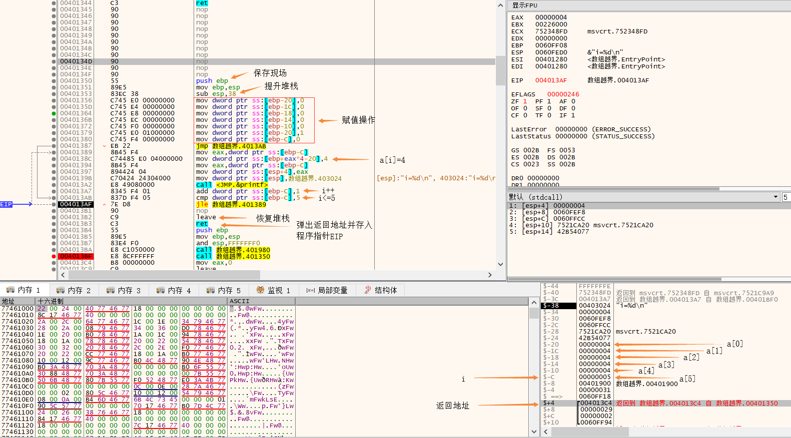

<!--
{
	"author": "lxf",
	"title": "C语言缓冲区溢出数组越界反汇编分析",
	"date": "2019-04-11 02:35:17",
	"category": "C语言程序设计"
}
-->

C语言缓冲区溢出数组越界反汇编分析
------------------------------------------------------------  
源代码
```
#include <stdio.h>

void helloworld()
{
	printf("hello world\n");
}

// 返回地址覆盖
void fun()
{
	int i;
	int arr[5] = {0,1,2,3,4};
	arr[6] = (int)helloworld;
}

// 数组越界
void fun1()
{
	int i;
	int a[5] = {1};
	for(i=0; i <= 5; i++)
	{
		a[i] = 4;
		printf("i=%d\n", i);
	}
}

int main(int argc, char const *argv[])
{
    fun1();
    return 0;
}

```
分析结果图如下：  
  
------------------------------------------------------------
[返回上级目录](./../../../../categories/C语言程序设计/README.md)  |
[返回首页](./../../../../README.md)